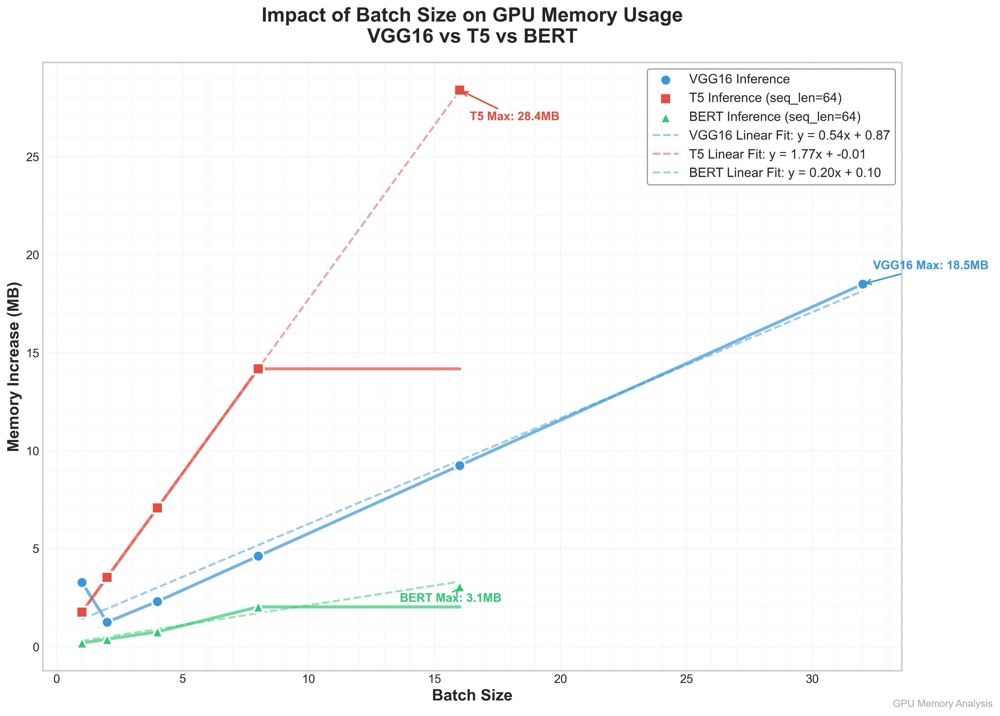
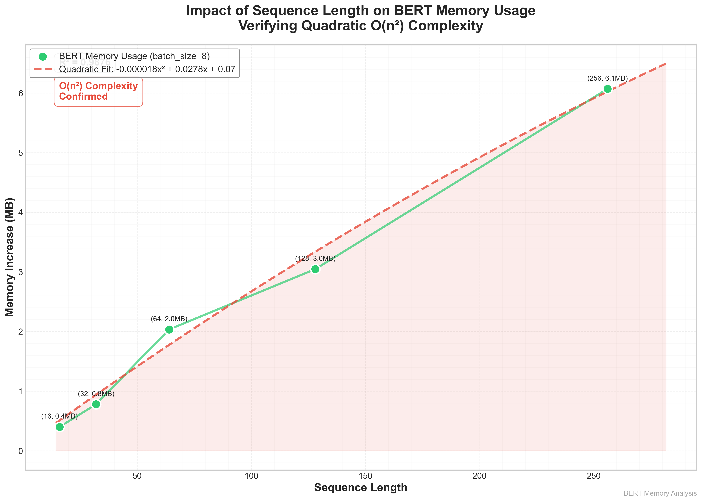
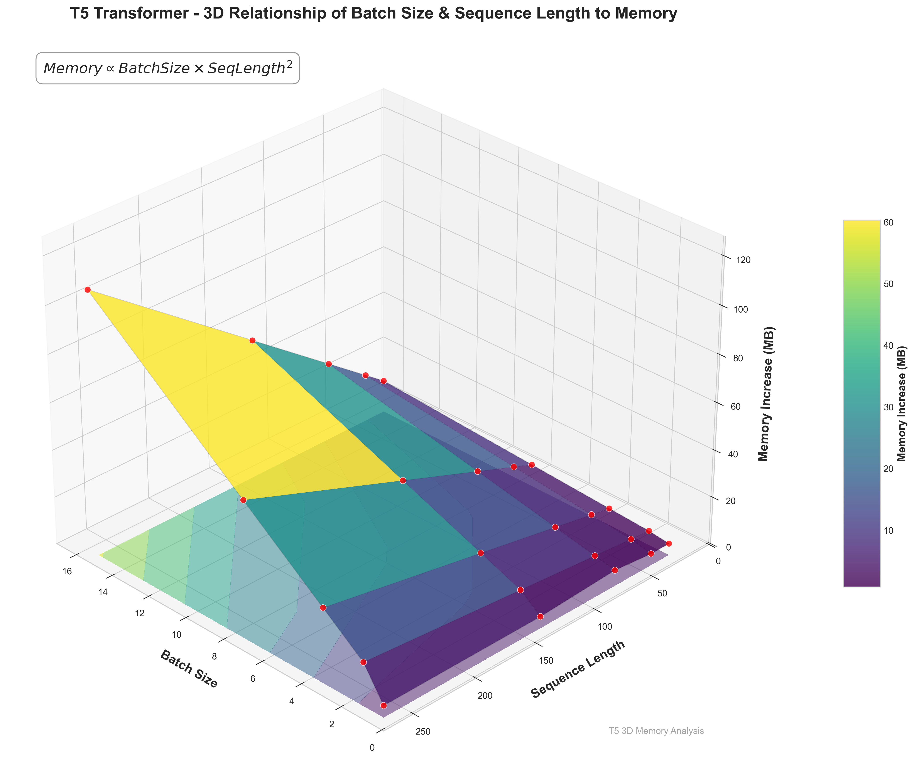
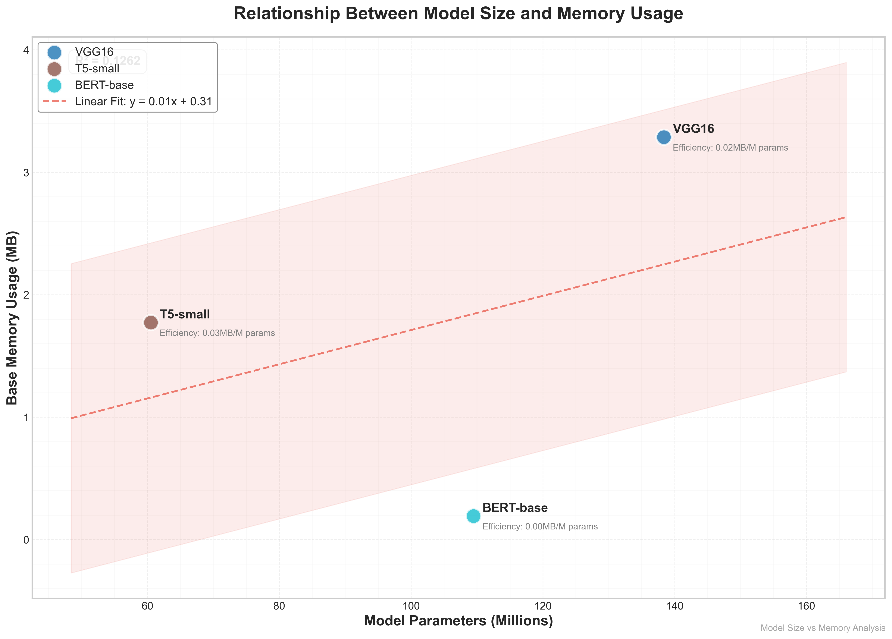

# DeepModel-XRay

[](https://www.python.org/downloads/release/python-380/)
[](https://pytorch.org/)
[](https://github.com/huggingface/transformers)

## 🌟 Overview

This project provides a comprehensive toolkit for analyzing the performance characteristics of mainstream deep learning models. It delves into three core areas: **model architecture**, **parameter counting**, and **GPU memory consumption**. By systematically measuring and visualizing these aspects, we provide deep insights into how models like VGG, T5, and BERT behave under various conditions.

This toolkit is perfect for researchers, students, and engineers who want to:

- Understand the internal structure of complex neural networks.
- Verify theoretical parameter calculations against actual model implementations.
- Profile and optimize GPU memory usage for training and inference.
- Quantify the impact of hyperparameters like `batch_size` and `sequence_length` on performance.

---

## ✨ Features

- **Model Structure Analysis**: Print detailed, layer-by-layer breakdowns of model architectures.
- **Parameter Statistics**: Accurately compute total and trainable parameters using `torchinfo`.
- **GPU Memory Profiling**: Measure memory allocated for model weights, activations, and peak usage during inference.
- **Hyperparameter Impact Analysis**: Systematically test and visualize how `batch_size` and `sequence_length` affect memory footprint.
- **Advanced Visualizations**: Generate a suite of insightful plots, including:
  - Batch Size vs. Memory Usage
  - Sequence Length vs. Memory Usage (validating O(n²) complexity for Transformers)
  - 3D Memory Surface Plots
  - Parameters vs. Base Memory
  - Per-Layer Memory Distribution (Pie & Bar charts)
- **Automated Reporting**: Automatically generate detailed analysis reports in Markdown.

---

## 🚀 Models Analyzed

The study covers a representative set of models from different architectural families:

- **CNN**: `VGG16` (from `torchvision`)
- **Encoder-Decoder Transformer**: `T5-small` (from `transformers`)
- **Encoder-Only Transformer**: `BERT-base-uncased` (from `transformers`)

---

## 📊 Key Visualizations & Findings

Our analysis reveals critical performance relationships and provides intuitive visualizations to understand them.

### Memory vs. Batch Size & Sequence Length

We empirically confirm well-known performance characteristics:

- **Linear Growth with Batch Size**: GPU memory usage for activations scales linearly with the batch size.
- **Quadratic Growth with Sequence Length**: For Transformer models (T5, BERT), memory usage grows quadratically with sequence length due to the self-attention mechanism's O(n²) complexity.

|                 Batch Size Impact Comparison                 |                Sequence Length Impact (BERT)                 |
| :----------------------------------------------------------: | :----------------------------------------------------------: |
|  |  |

### 3D Memory Surface

A 3D surface plot vividly illustrates the combined impact of batch size and sequence length on memory. This visualization makes it clear that sequence length is the more dominant factor in memory growth for Transformers.



### Model Size vs. Memory Efficiency

While larger models naturally consume more memory, the relationship isn't always straightforward. We analyze the memory footprint relative to the number of parameters to compare the architectural efficiency of different models.



---

## 🛠️ Setup & Usage

### 1. Prerequisites

Ensure you have a **CUDA-enabled GPU** and Python 3.8+ installed. All dependencies are listed in `requirements.txt`.

```bash
pip install -r requirements.txt
```


### 2. Running the Analysis

The analysis is divided into three main tasks, each with its own script.

**Task 1: Model Structure Analysis**
To print the architecture of the models:

```bash
python task1_struct_analysis.py
```

**Task 2: Parameter Calculation**
To get a detailed summary of model layers and parameter counts:

```bash
python task2_param_statistic.py
```

**Task 3: GPU Memory Profiling**
This is the main analysis script. It will run a series of tests and generate all plots and a Markdown report in the `gpu_memory_analysis_results_3/` directory.

```bash
python task3_memory_usage_3.py
```

---

## 📂 Codebase Structure

- `task1_struct_analysis.py`: Loads and prints the architecture of VGG16, T5, and BERT.
- `task2_param_statistic.py`: Uses `torchinfo` to generate detailed summaries and parameter counts for the models.
- `task3_memory_usage_3.py`: Contains the `GPUMemoryMonitor` class that handles memory measurement, analysis, visualization, and report generation.
- `gpu_memory_analysis_results_3/`: Output directory for all generated plots and the final Markdown report.

---

## 🔬 Analysis Highlights

- **Linear vs. Quadratic Complexity**: Our tests confirm that for a fixed input size, memory usage scales linearly with `batch_size`. For Transformer models, memory usage scales quadratically with `sequence_length`, as demonstrated by the excellent quadratic curve fits (R² > 0.99) on the collected data. The fitted equation for BERT, for example, clearly shows a dominant squared term.

- **Layer-wise Memory Distribution**: For VGG16, the majority of activation memory is consumed by the early, large-resolution convolutional layers. In contrast, for Transformers like BERT and T5, the memory is more evenly distributed across the Transformer blocks, with the self-attention and feed-forward networks being the primary consumers.

- **Memory-to-Parameter Ratio**: We found that different architectures have distinct memory efficiency profiles. BERT, despite having fewer parameters than VGG16, can consume comparable or even more memory for activations depending on the sequence length. Our analysis provides a "MB per Million Parameters" metric, offering a way to compare the operational memory cost of different model designs.

---

## ✍️ Authors

- **Tinghong Ye** ([叶庭宏](https://github.com/yediong))
- **Yaowen Hu** (胡耀文)
- **Feiyang Li** (李飞扬)

